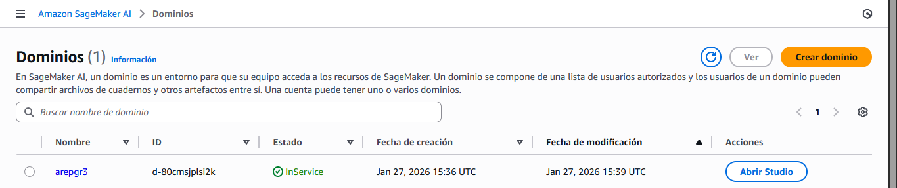
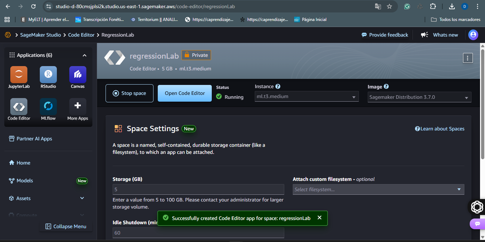
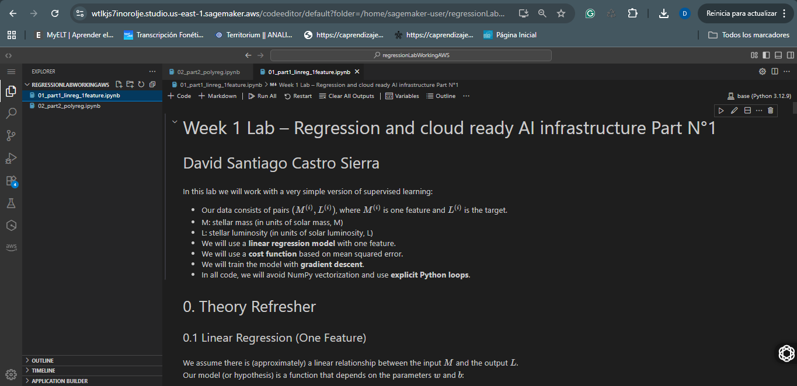
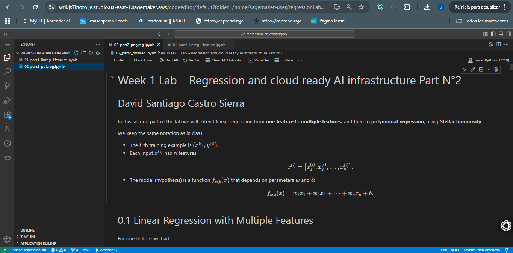
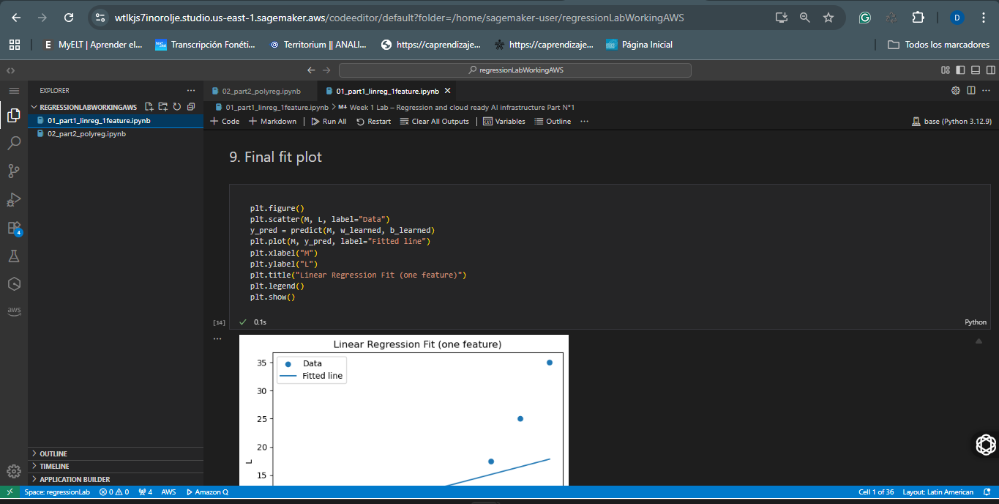
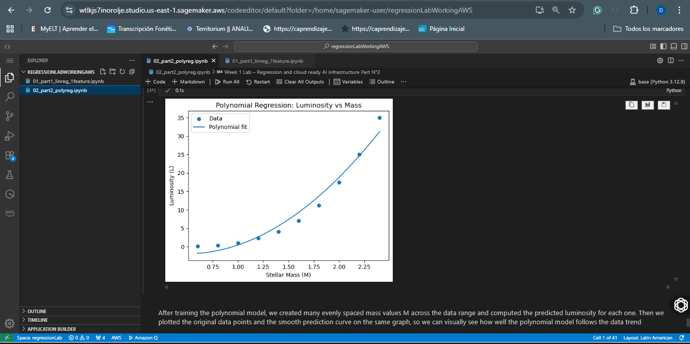
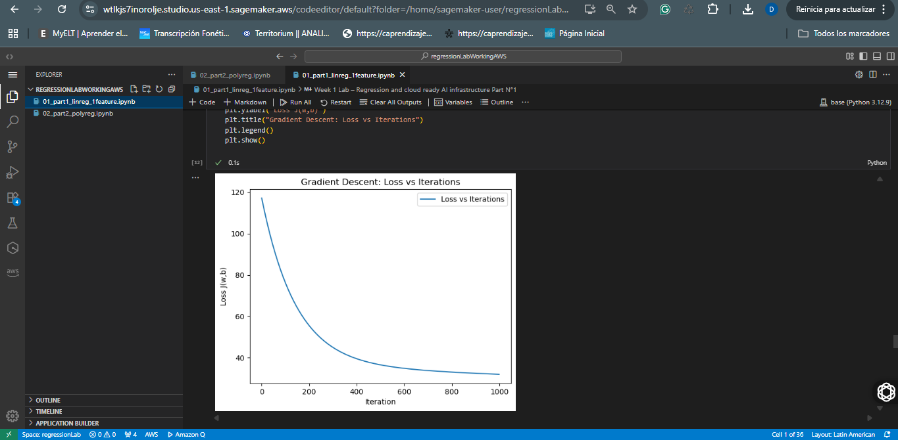
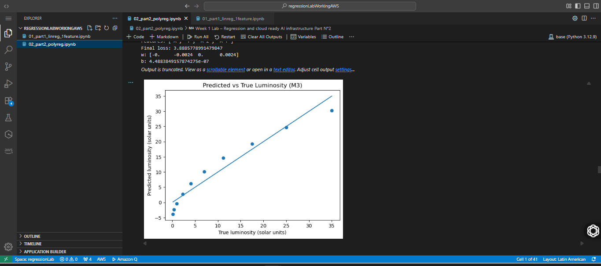

# Stellar Luminosity Regression (Linear & Polynomial Models)

This repository contains two Jupyter notebooks where you implement **linear regression** and **polynomial regression** from first principles (no ML fitting libraries) to model a simplified astronomy problem: **predicting stellar luminosity** using features such as mass and temperature, including nonlinear and interaction effects.

---

## Getting Started

These instructions will help you run the notebooks locally (for development/testing) and in **AWS SageMaker** (execution-only, as required).

### What’s inside

- **01_part1_linreg_1feature** — linear regression with one feature + gradient descent (from scratch)
- **02_part2_polyreg** — polynomial + interaction feature engineering and multi-parameter training
---

## Prerequisites

### You need to install

- **Python 3.10+**
- **Jupyter Notebook / JupyterLab**
- **pip**
- (For cloud requirement) **An AWS account with access to SageMaker**

### Python libraries used

- `numpy`
- `pandas`
- `matplotlib`

---

## Installing

A step-by-step series of examples that tell you how to get a development environment running.

### 1) Clone the repository

```bash
git clone https://github.com/daviidc29/lab1-Arep
cd lab1-Arep
```

### 2) Install dependencies 

If you don’t, install directly:

```bash
pip install numpy pandas matplotlib
```

### 3) Run Jupyter

```bash
jupyter lab
```

Open and run (Run → Run All Cells):

* `01_part1_linreg_1feature.ipynb`
* `02_part2_polyreg.ipynb`

---

## Quick Demo (Example)

After training in **02_part2_polyreg**, the notebook includes a simple inference example that builds engineered features (including squared mass and interaction term) and predicts luminosity.

Example format:

```python
import numpy as np

# Example engineered feature vector: [M, T, M^2, M*T]
M, T = 1.3, 6600
x = np.array([[M, T, M**2, M*T]])

# Use the trained parameters you got from the notebook output
w = np.array([10.8155, -0.0012, 0.7975, 0.0001])  # <-- replace if yours differ
b = 4.6839                                        # <-- replace if yours differ

pred = x @ w + b
print("Predicted Luminosity:", float(pred))
```

---

## Running the tests

This homework is notebook-based, so “tests” here mean **validation cells** and **expected behaviors**.

### End-to-end tests (notebook execution)

What these tests verify:

* The notebook runs **top-to-bottom with no errors**
* The **cost decreases** across gradient descent iterations
* At least **one plot renders correctly** (loss curve and/or predicted vs true scatter)

How to run:

1. Open a notebook
2. Click **Run → Run All Cells**
3. Confirm outputs show decreasing cost and plots appear

Example expected behavior:

* In the gradient descent logs, the cost should go down as iterations increase.

## Deployment

No model deployment (endpoints/MLOps pipelines) is required. This repository is intended for:

* Local notebook execution, and
* **AWS SageMaker execution (run-only)** as evidence of cloud execution.

---

## AWS SageMaker Execution Evidence 

This section is required to prove you executed both notebooks in SageMaker.

### How I uploaded the notebooks to SageMaker

1. Open **AWS SageMaker Studio** (or a Notebook Instance).
2. Create/open a workspace (Studio) or Jupyter environment (Notebook Instance).
3. Upload both notebooks (`01_part1_linreg_1feature.ipynb` and `02_part2_polyreg.ipynb`) using the file browser:

   * **Upload** → select the `.ipynb` files
4. Open each notebook and run:

   * **Run → Run All Cells**
5. Confirm:

   * No errors
   * Outputs are visible
   * At least one plot renders

---

### Screenshots:






**1) Both notebooks visible/open in SageMaker**





**2) Successful execution**






**3) At least one plot rendered in SageMaker**





### Local vs SageMaker 

- **Local execution:** runs using my local Python environment and local Jupyter install.
- **SageMaker execution:** runs inside an AWS-managed environment (kernel/conda image).

Differences observed:
  * Package install time: **SageMaker was slightly faster**, and dependency installation took **less time** compared to local.
  * Kernel version/environment: SageMaker provided a **more up-to-date kernel/environment** than the one available locally.
  * Plot rendering/output differences: **No functional differences** were observed; plots rendered correctly in both environments (SageMaker felt slightly more responsive overall).

---

## Built With

* **Python** — core language used for implementation
* **Jupyter Notebook** — interactive execution environment
* **NumPy** — array math for implementing the hypothesis, cost, and gradient descent
* **Matplotlib** — plots (loss curves and predictions vs truth)
* **Pandas** — light data handling (where applicable)

---

## Contributing

If you want to contribute:

1. Fork the repo
2. Create a feature branch
3. Submit a pull request with a clear description

---

## Authors

* **David Santiago Castro Sierra** — initial work

---

## Acknowledgments

* Jupyter ecosystem (Notebook/JupyterLab)
* Course/Bootcamp context for ML-from-scratch practice
* Inspiration: learning how optimization works by implementing it explicitly


